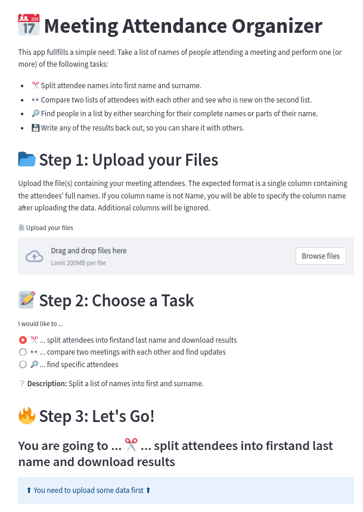

---

---
# 📅 Meeting Attendance Organizer

This app, which [you can use on Streamlit Cloud Community](https://walkenho-streamlit-meeting-attendance-o-srcmaorganizerui-djmdyv.streamlit.app/) fullfills a simple need: It lets users upload one or more lists of names of people attending a meeting and performs the following tasks:

* ✂️ Split attendee names into first name and surname.
* 👀 Compare two lists of attendees with each other and see who is new on the second list.
* 🔎 Find people in a list by either searching for their complete names or parts of their name
* 💾 Write any of the results back out, so you can share it with others.

Note, that the deployment is not done from this repository, but from [my Streamlit Deployment repository](https://github.com/walkenho-streamlit). For more information, why this is, see [Why I won’t deploy Streamlit applications from my main GitHub account and neither should you](https://walkenho.github.io/excuse-me-streamlit-cloud-you-want-what/). For more information why I built this app, see [Building and Deploying a Meetup Organizer App for London’s PyData Meetup - Why and How I built an App to Help Me Organize London's PyData Meetup](https://walkenho.github.io/building-a-meeting-organizer-app-with-streamlit/). 
